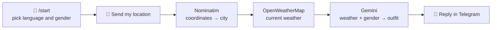

<div align="center">

# 🧥 Weather Stylist Bot

**Share your location. Get the weather. Know what to wear.**

A Telegram bot that finds your city, checks the live weather and asks Google Gemini
for a short, friendly outfit recommendation, in English or Ukrainian.


### 👉 [Try it: @weather_stylist_for_you_bot](https://t.me/weather_stylist_for_you_bot)


https://github.com/user-attachments/assets/9657963e-2f51-4516-89f7-b17cf6d63f12


</div>

---

## ✨ Features

- 🌍 **Two languages.** English or Ukrainian, chosen on `/start`.
- 🚻 **Gender-aware advice.** Outfit suggestions are tailored to male or female.
- 📍 **Location-based.** Your Telegram location is reverse-geocoded to a city with OpenStreetMap (Nominatim).
- 🌡️ **Live weather.** Temperature, description, humidity and wind speed from OpenWeatherMap.
- 🤖 **AI stylist.** A short, emoji-flavored recommendation generated by Google Gemini.
- ☁️ **Always on, free hosting.** Runs as a webhook on Vercel serverless functions.
- 💾 **Persistent settings.** Language and gender live in Redis (Upstash), so they survive between requests.

## 🧩 How it works



In production, Telegram sends every message to the Vercel function as a webhook `POST` request.
The function processes the update with aiogram, replies, and shuts down. Locally the bot uses polling instead,
so no server or public URL is needed.

| Part | Tech | Role |
|---|---|---|
| **Entry point** (`index.py`) | FastAPI | Receives Telegram webhooks on Vercel |
| **Handlers** (`src/hendlers.py`) | aiogram 3 | Onboarding, location handling, Gemini call |
| **Weather** (`src/weather.py`) | OpenWeatherMap | Fetches current weather for a city |
| **Storage** (`src/storage.py`) | Upstash Redis | Keeps language and gender per user |

<details>
<summary><b>Why serverless instead of a always-running server?</b></summary>

<br>

- **Free and always on.** Vercel's free plan is enough for a pet project, and there is no server to keep alive.
- **Webhook model fits the bot.** The bot only does work when a message arrives, so a function that wakes up per request is a natural match.
- **State lives outside the function.** A serverless function forgets everything between calls, so settings go to Redis.
  Without Redis, the bot falls back to in-memory storage and resets on restart.

</details>

## 📁 Project structure

```
.
├── index.py          # Vercel entry point: FastAPI app that receives Telegram webhooks
├── vercel.json       # Vercel routing and function settings
├── requirements.txt  # Python dependencies
└── src/
    ├── main.py       # Local entry point (polling), for development only
    ├── hendlers.py   # Telegram handlers: onboarding, location, Gemini call
    ├── weather.py    # OpenWeatherMap API wrapper
    └── storage.py    # User settings storage (Redis, with in-memory fallback)
```

## 🚀 Quick start

### 1. Requirements

| Tool | Notes |
|---|---|
| **Python 3.10+** | Check with `python --version` |
| **Telegram bot token** | Create a bot with [@BotFather](https://t.me/BotFather) |
| **OpenWeatherMap API key** | Get one at [openweathermap.org](https://openweathermap.org/api) |
| **Gemini API key** | Get one at [ai.google.dev](https://ai.google.dev/) |

### 2. Environment variables

| Variable | Required | Description |
|---|---|---|
| `TelegramBotToken` | ✅ | Bot token from [@BotFather](https://t.me/BotFather) |
| `WeatherAPIKey` | ✅ | OpenWeatherMap API key |
| `GEMINI_API_KEY` | ✅ | Google Gemini API key |
| `TELEGRAM_SECRET` | ➖ | Secret string to verify that webhook requests come from Telegram |
| `UPSTASH_REDIS_REST_URL` / `UPSTASH_REDIS_REST_TOKEN` | ➖ | Redis credentials (`KV_REST_API_URL` / `KV_REST_API_TOKEN` also work). Without them, settings are kept in memory and reset on restart |

### 3. Run locally

```bat
git clone https://github.com/Maksimuson/Weather-Stylist-Bot.git
cd Weather-Stylist-Bot
pip install -r requirements.txt
```

Create a `.env` file in the project root (never commit it):

```env
TelegramBotToken=your_telegram_bot_token
WeatherAPIKey=your_openweathermap_api_key
GEMINI_API_KEY=your_gemini_api_key
```

Then start the bot:

```bat
cd src
python main.py
```

> [!WARNING]
> A Telegram bot can use either polling or a webhook, not both. `main.py` removes the webhook on start,
> so stop it before relying on the Vercel deployment again, and re-set the webhook afterwards.

## ☁️ Deploy to Vercel

| Step | Action |
|---|---|
| **1. Push** | Push the repository to GitHub. |
| **2. Import** | On [vercel.com](https://vercel.com), choose **Add New → Project** and import the repository. |
| **3. Variables** | Add `TelegramBotToken`, `WeatherAPIKey`, `GEMINI_API_KEY` (and optionally `TELEGRAM_SECRET`), then deploy. |
| **4. Redis** | In the project's **Storage** tab, create an **Upstash Redis** database (free plan), connect it to the project and **Redeploy**. |
| **5. Protection** | In **Settings → Deployment Protection**, disable Vercel Authentication so Telegram can reach the endpoint. |
| **6. Webhook** | Register the webhook (see below). |
| **7. Check** | Open `getWebhookInfo` (see below). `last_error_message` should be empty. |

**Register the webhook** by opening this URL in your browser (replace the placeholders):

```
https://api.telegram.org/bot<YOUR_BOT_TOKEN>/setWebhook?url=https://<your-project>.vercel.app/webhook
```

If you set `TELEGRAM_SECRET`, append `&secret_token=<the same value>`.

**Check the status:**

```
https://api.telegram.org/bot<YOUR_BOT_TOKEN>/getWebhookInfo
```

## 🎮 Usage

1. Open [@weather_stylist_for_you_bot](https://t.me/weather_stylist_for_you_bot) and send `/start`.
2. Pick your **language** (English or Ukrainian) and your **gender**.
3. Tap the **Send my location** button.
4. Get a short outfit suggestion for the weather in your city.

Language and gender are saved, so next time you only need to share your location.

## 🔒 What data goes where

| Data | Sent to | Why |
|---|---|---|
| Coordinates | Nominatim (OpenStreetMap) | To find your city |
| City name | OpenWeatherMap | To fetch the current weather |
| Weather data and gender | Google Gemini | To generate the outfit suggestion |
| Language and gender | Redis (Upstash) | To remember your settings |

## 🛠️ Troubleshooting

| Symptom | Likely cause |
|---|---|
| Bot does not answer in production | Check `getWebhookInfo`. `last_error_message` shows what Telegram sees |
| Webhook returns an authorization error | Vercel Authentication is still enabled. Disable it in **Deployment Protection** |
| Bot stopped answering after running locally | `main.py` removed the webhook. Register it again with `setWebhook` |
| Settings reset after a while | Redis is not connected, so the in-memory fallback is used |
| "Styling assistant is temporarily unavailable" | A free-tier quota ran out (Gemini, OpenWeatherMap, Vercel or Upstash) |

> [!TIP]
> If a token is ever exposed, revoke it in @BotFather and update it in Vercel.

## 📝 Notes

- The Gemini model is `gemini-3.1-flash-lite`, which is fast and cheap. Change `MODEL_NAME` in `src/hendlers.py` to use another one.
- Weather descriptions are requested in Russian (`lang=ru`) from OpenWeatherMap regardless of the bot's UI language.
  Adjust `src/weather.py` if you would like this to follow the user's chosen language.
- Free-tier quotas apply to every external service the bot uses.
- Keep tokens and API keys out of the repository.

## 💬 Feedback

This is a pet project, so bug reports, feature ideas and pull requests are welcome!

---

<div align="center">

If you find the project useful, a ⭐ on the repo is always appreciated.

</div>
